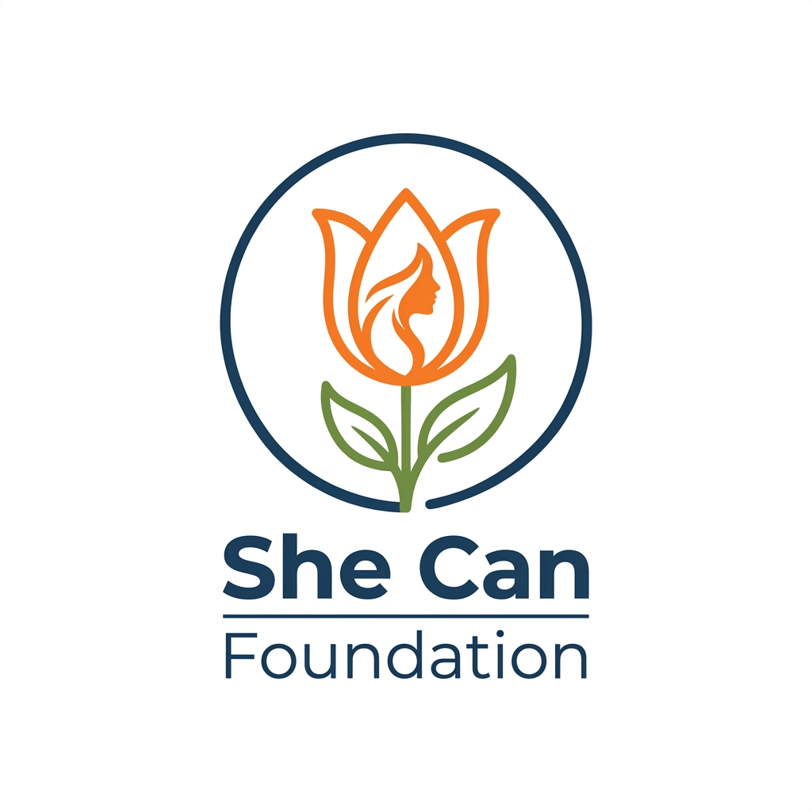
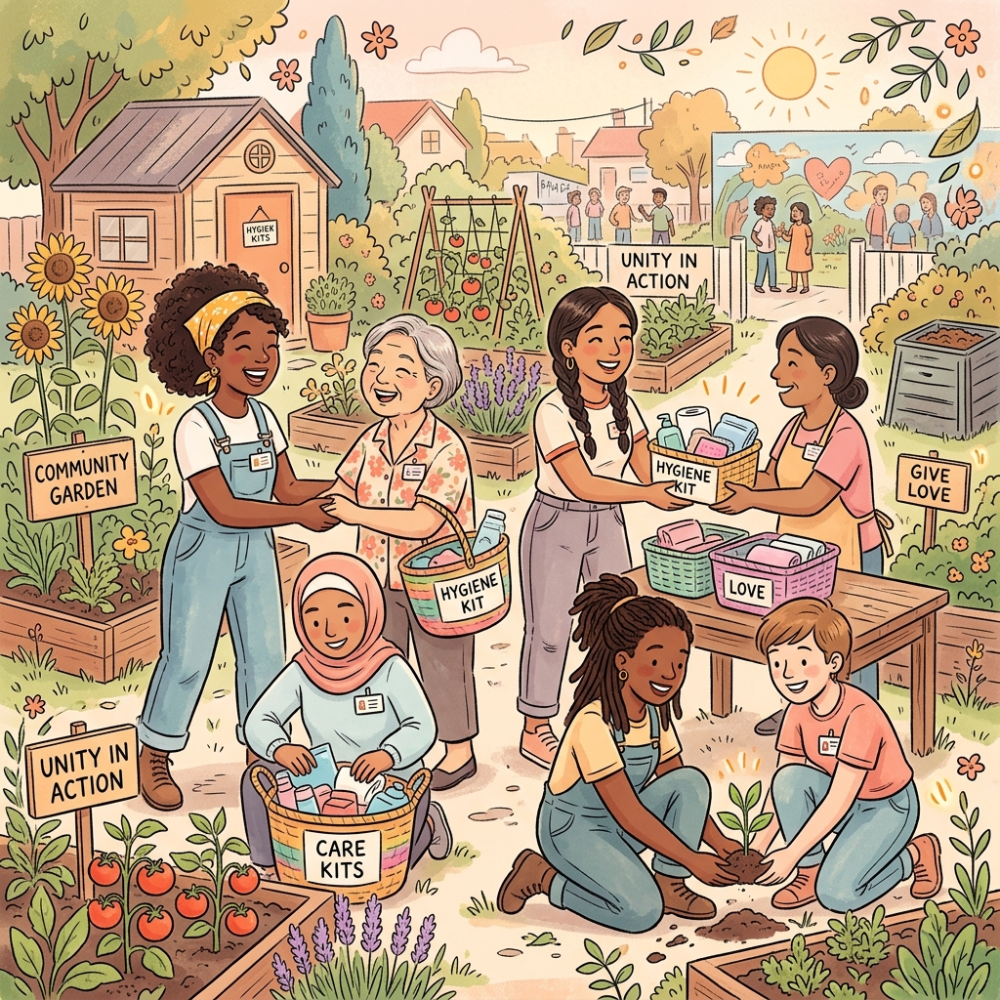

# 🌸 SHE CAN FOUNDATION | Together We Can Change The World

She Can Foundation is a non-governmental organization registered under the Indian Society Act, 1860, dedicated to empowering women, breaking barriers, and transforming lives. We focus on providing resources, education, healthcare support, and digital/vocational training to women in local and global communities.

### 🌐 Live Deployments & Source
*   🐙 **[GitHub Repository](https://github.com/naziashakil27/shecanfoundation)**
*   🚀 **[Live Showcase Website](https://naziashakil27.github.io/shecanfoundation/)**
*   ⚡ **[Vercel Live Site](https://shecanfoundation-opal.vercel.app/)**

---

## 🌟 Mission & Key Pillars

*   **Women's Health & Hygiene:** Spreading awareness about menstrual hygiene and distributing sanity kits and health resources.
*   **Vocational Skill-development:** Empowering women with technical skills, tailoring, digital literacy, and financial literacy to support self-reliance.
*   **Global Community Support:** Mentorship networks linking volunteers and professionals with women seeking growth opportunities.

---

## 🎨 Interactive Landing Page Features

*   **Fluid Anti-Gravity Card bobbing:** Utilizes **GSAP (GreenSock Animation Platform)** to create unique, floating animations for information boxes.
*   **Continuous Spin Logo:** Sleek spinning animation of the circular tulip flower brand logo.
*   **Interactive Button Bounces:** Elastic scale bouncers when hovering over CTAs and socials for enhanced feedback.
*   **Hand-drawn Aesthetic:** Highlighted by charming floating background doodles and hand-sketched boundaries.

---

## 📸 Local Brand Visuals

All images are served locally inside the [assets/](assets/) folder:

| Tulip Brand Logo | Volunteers Illustration | Favicon Icon |
| :---: | :---: | :---: |
|  |  |  |
| *Tulip Brand Logo* | *Diverse Volunteers Collaboration* | * tulipal Favicon* |

---

## 💻 Running Locally

Simply clone the repository and open `index.html` in any web browser, or serve it using a local HTTP server:

```bash
# Clone the repository
git clone https://github.com/naziashakil27/shecanfoundation.git

# Navigate into the folder
cd shecanfoundation

# Serve locally (optional, e.g., using python or live-server)
python -m http.server 8000
```
Open `http://localhost:8000` in your browser.